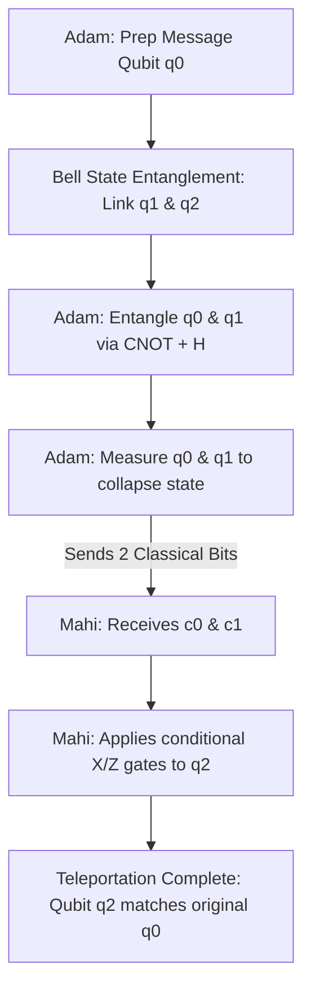

# 🌌 Quantum Teleportation Messenger

A full-stack, visually immersive simulation demonstrating **Quantum State Teleportation** under the hood of a real quantum simulator (**Qiskit**). It features an interactive **Eavesdropping Simulator** that physically proves why quantum channels are unhackable due to the laws of quantum mechanics.

🔗 **Live Online Demo:** [quantum-whisper-secure-messaging-via.onrender.com](https://quantum-whisper-secure-messaging-via.onrender.com)

---

## 🚀 Quick Start: Running Locally

Follow these steps to run the quantum simulation server on your own computer:

### 1. Install Dependencies
Make sure you have Python 3.8+ installed. Install the Qiskit simulator and Flask framework:
```bash
pip install qiskit qiskit-aer flask numpy gunicorn
```

### 2. Run the App
Start the Flask server directly from the root directory:
```bash
python app.py
```

### 3. Access the Visualizer
Open your browser and navigate to:
👉 **[http://localhost:5000](http://localhost:5000)**

---

## 🧠 Deep Explanation: What is Happening & Why?

This app simulates a 3-qubit system ($q_0, q_1, q_2$) running on Qiskit's `AerSimulator`. Below is the detailed mathematical and physical process of how information is securely teleported from **Adam** to **Mahi**.



### 1. Entanglement Distribution (The Bell State)
Before any message is sent, a third-party source creates an entangled pair of qubits ($q_1$ and $q_2$) and distributes them: $q_1$ goes to Adam, and $q_2$ goes to Mahi. 
They are put into the **Mermin-Bell state** ($|\Phi^+\rangle$):
$$|\Phi^+\rangle = \frac{|00\rangle + |11\rangle}{\sqrt{2}}$$
*   **Why?** In this state, neither qubit has a definite value, but they are perfectly correlated. If $q_1$ is measured as `0`, $q_2$ instantly becomes `0`, and vice versa. This shared entanglement acts as the "quantum channel".

### 2. Message Preparation (Superposition & Bloch Sphere)
Adam wants to send a secret state $|\psi\rangle$ to Mahi. He prepares $|\psi\rangle$ on his message qubit ($q_0$) by rotating it using $RY(\theta)$ and $RZ(\phi)$ gates:
$$|\psi\rangle = \cos\left(\frac{\theta}{2}\right)|0\rangle + e^{i\phi}\sin\left(\frac{\theta}{2}\right)|1\rangle$$
*   **What is the Bloch Sphere?** It is a sphere of radius 1 where any point on the surface represents a unique quantum state. The North Pole is $|0\rangle$, the South Pole is $|1\rangle$, and the latitude/longitude correspond to the angles $\theta$ and $\phi$. 

### 3. Bell State Measurement (Alice's Actions)
Adam performs a joint measurement on the message qubit $q_0$ and his entangled qubit $q_1$. To do this, he applies a $CNOT$ gate (with $q_0$ controlling $q_1$), followed by a Hadamard ($H$) gate on $q_0$.
*   **Why?** This entangles the message qubit with the shared quantum channel.
*   Adam then measures both $q_0$ and $q_1$, obtaining two classical bits: $c_0$ and $c_1$ (which can be `00`, `01`, `10`, or `11`).
*   **The collapse:** The act of measurement collapses Adam's qubits, meaning **the original state $|\psi\rangle$ is instantly destroyed on Adam's side**. This satisfies the **No-Cloning Theorem**—you cannot duplicate a quantum state, you can only move it.

### 4. Classical Information Transfer
Mahi's qubit $q_2$ now contains the information, but it is rotated into one of 4 possible configurations based on Adam's measurement outcome:
*   If Adam got `00`, Mahi's state is $|\psi\rangle$ (perfect).
*   If Adam got `01`, Mahi's state is $X|\psi\rangle$ (flipped vertically).
*   If Adam got `10`, Mahi's state is $Z|\psi\rangle$ (flipped horizontally).
*   If Adam got `11`, Mahi's state is $XZ|\psi\rangle$ (flipped both ways).
*   **Why is this secure?** Without knowing Adam's measurement results ($c_0, c_1$), Mahi's qubit looks like 100% random noise. Adam must send these 2 classical bits to Mahi over a standard cable or internet link. This proves quantum teleportation **cannot exceed the speed of light**, as it is bound by the speed of the classical bits.

### 5. Rotation & Reconstruction (Mahi's Actions)
Once Mahi receives the 2 classical bits:
*   If $c_1 = 1$, Mahi applies a **Bit-Flip ($X$) gate** to rotate his qubit vertically.
*   If $c_0 = 1$, Mahi applies a **Phase-Flip ($Z$) gate** to rotate his qubit horizontally.
*   **Result:** Mahi's qubit $q_2$ is now in the exact state $|\psi\rangle$ originally prepared by Adam. Teleportation is complete!

---

## 🕵️ The Security: Eavesdropping & The No-Cloning Theorem

What happens if an eavesdropper (**Eve**) taps the quantum channel to read the message?

### 1. The Interception
Eve intercepts the quantum channel ($q_2$) before it reaches Mahi and measures it.
*   **Why it fails for Eve:** Because of the **No-Cloning Theorem**, Eve cannot copy the qubit state to inspect it later. The moment she measures $q_2$, she forces the qubit to collapse into a definitive $|0\rangle$ or $|1\rangle$.
*   This measurement instantly **breaks the entanglement** between $q_1$ and $q_2$.
*   Eve re-prepares a random state and sends it to Mahi, but the damage is done. The quantum link is broken.

### 2. Detecting the Attack (Fidelity & Tomography)
When Mahi receives the classical bits and applies corrections, he does so on a collapsed state. When he tests the state:
*   **Fidelity ($F$):** Measures the overlap between Adam's original state and Mahi's received state.
    *   *No Eve:* $F = 1.0$ (100% match).
    *   *Eve active:* $F \approx 0.5$ (50% match, which is the mathematical representation of pure random noise).
*   **Quantum State Tomography:** In quantum mechanics, you cannot measure a single qubit to reconstruct its vector because measurement collapses it. To prove the fidelity is 50%, the console simulates running **1000 identical copies** of the teleported qubit and gathers statistics across different bases (measuring in $X, Y,$ and $Z$). 
*   This statistical check reveals the eavesdropper immediately. The communication is flagged as compromised, and the transmission is discarded.

---

## 📂 File Layout

The repository is built with a 100% flat layout for simplicity and ease of hosting:

```
.
├── LICENSE            # MIT License details
├── README.md          # This documentation and educational guide
├── requirements.txt   # Python dependency library list
├── app.py             # Python backend (Flask server & Qiskit logic)
└── index.html         # Frontend interface (layout, CSS glassmorphism, Bloch SVGs)
```

---

## 👥 Author & License

*   **Author:** **Mohibul hoque**
*   **Email:** [hokworks@gmail.com](mailto:hokworks@gmail.com)
*   **LinkedIn:** [linkedin.com/in/speedymohibul](https://www.linkedin.com/in/speedymohibul)

Licensed under the **MIT License**. See the [LICENSE](LICENSE) file for more information.
